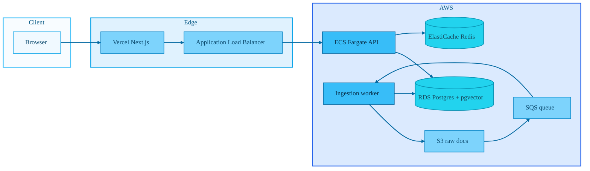

# Financial Research Copilot
**A retrieval-augmented research assistant over financial documents (SEC filings, transcripts, letters). The API hybrid-retrieves chunks from Postgres + pgvector, reranks with Cohere, then answers with Claude using explicit citations to source chunks.**
---

## Architecture



Local development replaces ECS/ALB with Docker Compose: `api`, `worker`, `postgres`, `redis`, **MinIO** (S3), and **ElasticMQ** (SQS). See [doc/high-level-architecture.md](doc/high-level-architecture.md).

> **Note:** AWS production deploy is optional. The full pipeline runs locally without an AWS account.

---

## Tech stack

| Layer | Choices |
|--------|---------|
| API | Python 3.11, FastAPI, SQLAlchemy 2 (async), Alembic |
| Data | PostgreSQL 15, pgvector, `tsvector` for BM25-style search |
| Retrieval | Dense vectors + full-text + RRF fusion + Cohere rerank |
| Generation | Anthropic Claude (grounded answers, parsed citations) |
| Cache | Redis (exact + semantic query cache, embedding cache, route cache) |
| Ingestion | S3/MinIO + SQS/ElasticMQ, async worker (parse → chunk → embed → insert) |
| Frontend | Next.js (App Router), Tailwind CSS, `react-markdown` |
| Infra | Docker, Terraform (VPC, ALB, ECS, WAF rate limit, etc.) |

**Why this shape:** pgvector gives fast semantic search on long documents; hybrid retrieval reduces “keyword vs semantic” blind spots; reranking improves top-k for the LLM; citations are validated against retrieved chunk IDs to catch index mistakes.

---

## Prerequisites

- Docker and Docker Compose
- For full behavior (embeddings, LLM, rerank): set API keys in `.env` (see [.env.example](.env.example))
- Node.js 20+ for the frontend

---

## Quick start (local, one command on Windows)

```powershell
.\scripts\bootstrap_local.ps1
```

Or manually:

```bash
cp .env.example .env   # add OPENAI_API_KEY, ANTHROPIC_API_KEY, COHERE_API_KEY
docker compose up -d --build
docker compose run --rm api python -m alembic upgrade head
API_URL=http://localhost:8000 S3_ENDPOINT_URL=http://localhost:9000 python scripts/seed_local.py
```

---

## Run the backend locally

From the repository root:

1. **Environment**

   ```bash
   cp .env.example .env
   ```

   Add `OPENAI_API_KEY`, `ANTHROPIC_API_KEY`, `COHERE_API_KEY`. For host-side scripts (seed, eval), set `S3_ENDPOINT_URL=http://localhost:9000` and MinIO credentials from `.env.example`.

2. **Start services**

   ```bash
   docker compose up -d --build
   ```

   Services: API `:8000`, Postgres `:5432`, Redis `:6379`, ElasticMQ `:9324`, MinIO `:9000` (console `:9001`).

3. **Apply database migrations**

   ```bash
   docker compose run --rm api python -m alembic upgrade head
   ```

4. **Seed corpus**

   ```bash
   python scripts/seed_local.py
   ```

   Ingests 15 synthetic financial documents across 10 tickers from [`data/local_seed_manifest.json`](data/local_seed_manifest.json).

5. **Check the API**

   ```bash
   curl http://localhost:8000/health
   curl -X POST http://localhost:8000/retrieve -H "Content-Type: application/json" -d "{\"query\":\"Tesla margin guidance\",\"filters\":{}}"
   ```

Interactive docs: [http://localhost:8000/docs](http://localhost:8000/docs) — includes `POST /query/stream` (SSE).

### Alembic workflow

```bash
alembic revision --autogenerate -m "describe_change"
alembic upgrade head
alembic downgrade -1
```

---

## Run the frontend locally

```bash
cd frontend
cp .env.local.example .env.local
npm install
npm run dev
```

Open [http://localhost:3000](http://localhost:3000). The UI calls Next.js route handlers under `/api/*`, which proxy to the backend (`API_BASE_URL` or `NEXT_PUBLIC_API_URL`, default `http://localhost:8000`).

Production deploy: set `API_BASE_URL` (and optionally `NEXT_PUBLIC_API_URL`) on Vercel to your public API base URL. See [frontend/README.md](frontend/README.md) for CI and Vercel secrets.

---

## Useful scripts and eval

| Path | Purpose |
|------|---------|
| [`scripts/bootstrap_local.ps1`](scripts/bootstrap_local.ps1) | One-shot local stack + migrate + seed (Windows) |
| [`scripts/seed_local.py`](scripts/seed_local.py) | Seed MinIO + ingest local manifest corpus |
| [`scripts/bulk_ingest_sp500.py`](scripts/bulk_ingest_sp500.py) | Bulk ingest tickers (`--local` for synthetic 10-Ks) |
| [`scripts/check_corpus.py`](scripts/check_corpus.py) | Summarize chunk counts and sanity-check embeddings |
| [`scripts/benchmark_index.py`](scripts/benchmark_index.py) | p50/p95 `/retrieve` latency smoke benchmark |
| [`eval/questions.csv`](eval/questions.csv) | **50-question** evaluation dataset with ground truth |
| [`eval/evaluate_retrieval.py`](eval/evaluate_retrieval.py) | Precision@5 evaluation → `eval/retrieval_scores.md` |
| [`eval/evaluate_generation.py`](eval/evaluate_generation.py) | Citation + adversarial refusal eval |
| [`eval/run_full_eval.py`](eval/run_full_eval.py) | Run full eval and update `eval/baseline.json` |
| [`perf/query-load-test.js`](perf/query-load-test.js) | k6 load test (`k6 run perf/query-load-test.js`) |

### Evaluation (Phase 6)

```bash
set API_URL=http://localhost:8000
python eval/run_full_eval.py
```

See [`eval/improvement_results.md`](eval/improvement_results.md) for before/after retrieval fixes (BM25 `websearch_to_tsquery`, filter fallback, expanded corpus).

---

## Engineering decisions

| Decision | Why |
|----------|-----|
| **pgvector HNSW** | Low-latency cosine search without IVFFlat training on small corpora |
| **Hybrid BM25 + dense + RRF** | Financial queries mix exact terms ("10-K", "gross margin") with semantic paraphrase |
| **Cohere Rerank** | Cross-encoder reranking improves top-5 precision before LLM context window |
| **Claude Sonnet** | Strong grounded synthesis with citation-friendly outputs |
| **MinIO locally** | Full ingest loop without AWS while account is suspended |
| **Filter relaxation fallback** | Prevents empty results when UI filters are stricter than corpus coverage |

---

## AWS production (deferred)

Terraform in [`infra/terraform/`](infra/terraform/) targets ECS/Fargate + RDS + S3 + SQS. When your AWS account is restored:

```bash
cd infra/terraform && terraform apply
```

Until then, use the local stack above for development, eval, and demo recording.

---

## Documentation

- [doc/developer-tasks.md](doc/developer-tasks.md) — phased task list and definitions of done  
- [doc/phase7-developer-tasks.md](doc/phase7-developer-tasks.md) — post-MVP depth (streaming, cache, eval CI)  
- [docs/debug/retrieval-arbitrary-query-rca.md](docs/debug/retrieval-arbitrary-query-rca.md) — retrieval bug RCA  
- [doc/requirements.md](doc/requirements.md) — product requirements  
- [doc/back-end-guide.md](doc/back-end-guide.md) — API and module orientation  
- [infra/terraform/README.md](infra/terraform/README.md) — AWS Terraform notes  
