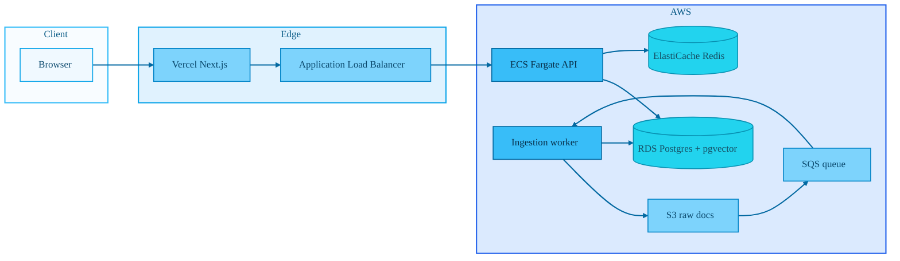

# Financial Research Copilot

A retrieval-augmented research assistant over financial documents (SEC filings, transcripts, letters). The API hybrid-retrieves chunks from Postgres + pgvector, reranks with Cohere, then answers with Claude using explicit citations to source chunks.
**Repository:** [github.com/kietcoderlor/financial-research-copilot](https://github.com/kietcoderlor/financial-research-copilot)

---

## Architecture



Local development replaces ECS/ALB with Docker Compose services (`api`, `worker`, `postgres`, `redis`, ElasticMQ). See [doc/high-level-architecture.md](doc/high-level-architecture.md) for detail.

---

## Tech stack

| Layer | Choices |
|--------|---------|
| API | Python 3.11, FastAPI, SQLAlchemy 2 (async), Alembic |
| Data | PostgreSQL 15, pgvector, `tsvector` for BM25-style search |
| Retrieval | Dense vectors + full-text + RRF fusion + Cohere rerank |
| Generation | Anthropic Claude (grounded answers, parsed citations) |
| Cache | Redis (query + embedding cache) |
| Ingestion | S3 + SQS, async worker (parse → chunk → embed → insert) |
| Frontend | Next.js (App Router), Tailwind CSS, `react-markdown` |
| Infra | Docker, Terraform (VPC, ALB, ECS, WAF rate limit, etc.) |

**Why this shape:** pgvector gives fast semantic search on long documents; hybrid retrieval reduces “keyword vs semantic” blind spots; reranking improves top-k for the LLM; citations are validated against retrieved chunk IDs to catch index mistakes.

---

## Prerequisites

- Docker and Docker Compose
- For full behavior (embeddings, LLM, rerank): set API keys in `.env` (see [.env.example](.env.example))
- Node.js 20+ for the frontend

---

## Run the backend locally

From the repository root:

1. **Environment**

   ```bash
   cp .env.example .env
   ```

   Edit `.env` and add keys as needed (`OPENAI_API_KEY`, `ANTHROPIC_API_KEY`, `COHERE_API_KEY`). The Compose file injects sensible defaults for `DB_URL`, Redis, and ElasticMQ; align `.env` if you run tools on the host against `localhost:5432`.

2. **Start services**

   ```bash
   docker compose up -d
   ```

3. **Apply database migrations**

   ```bash
   docker compose run --rm api python -m alembic upgrade head
   ```

   On Windows you can instead run [`scripts/alembic-upgrade.ps1`](scripts/alembic-upgrade.ps1) from the repo root with `DB_URL` pointing at the Compose Postgres URL (see script header).

4. **Check the API**

   ```bash
   curl http://localhost:8000/health
   ```

Interactive docs: [http://localhost:8000/docs](http://localhost:8000/docs).

Ingestion and [`scripts/seed_corpus.py`](scripts/seed_corpus.py) expect S3 and a reachable worker queue; use real AWS credentials and bucket, or configure an S3-compatible endpoint if your environment provides one.

---

## Run the frontend locally

```bash
cd frontend
cp .env.local.example .env.local
npm install
npm run dev
```

Open [http://localhost:3000](http://localhost:3000). The UI calls Next.js route handlers under `/api/*`, which proxy to the backend (`API_BASE_URL` or `NEXT_PUBLIC_API_URL`, default `http://localhost:8000`).

Production deploy: set `API_BASE_URL` (and optionally `NEXT_PUBLIC_API_URL`) on Vercel to your public API base URL. See [frontend/README.md](frontend/README.md) for CI and Vercel secrets.

---

## Useful scripts and eval

| Path | Purpose |
|------|---------|
| [`scripts/check_corpus.py`](scripts/check_corpus.py) | Summarize chunk counts and sanity-check embeddings |
| [`scripts/seed_corpus.py`](scripts/seed_corpus.py) | Upload sample objects and drive `POST /ingest` |
| [`eval/run_retrieval_spot_check.py`](eval/run_retrieval_spot_check.py) | Spot-check retrieval |
| [`eval/run_generation_spot_check.py`](eval/run_generation_spot_check.py) | Spot-check generation + citations |

---

## Documentation

- [doc/developer-tasks.md](doc/developer-tasks.md) — phased task list and definitions of done  
- [doc/requirements.md](doc/requirements.md) — product requirements  
- [doc/back-end-guide.md](doc/back-end-guide.md) — API and module orientation  
- [infra/terraform/README.md](infra/terraform/README.md) — AWS Terraform notes  
